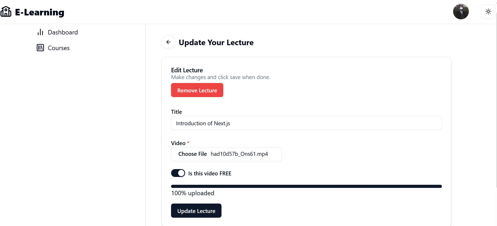
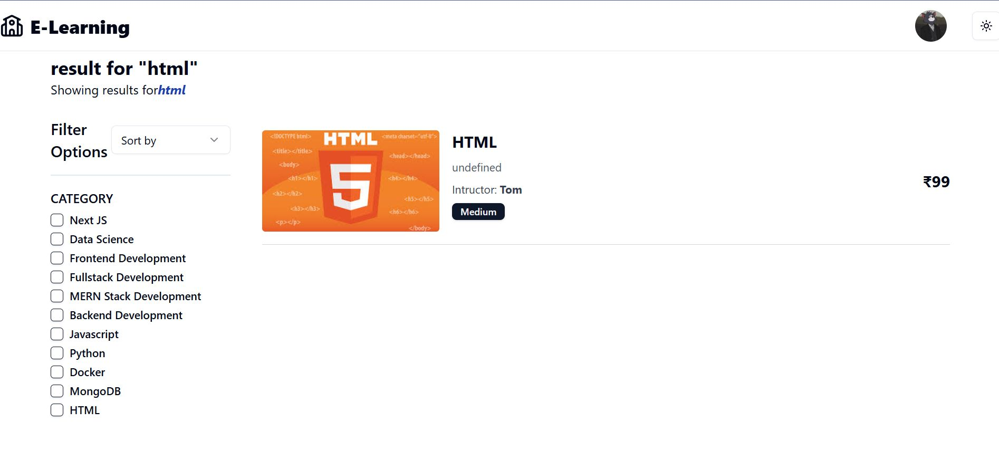
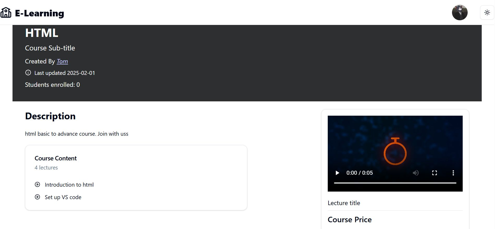
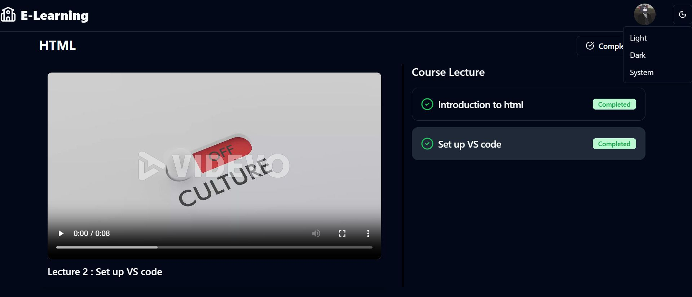
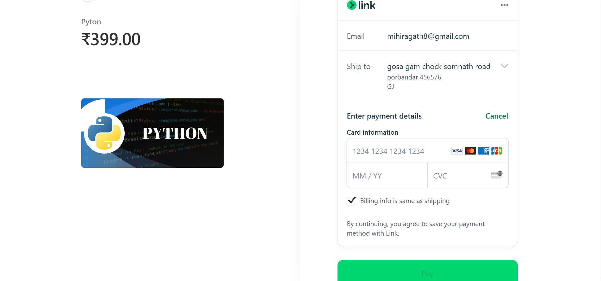
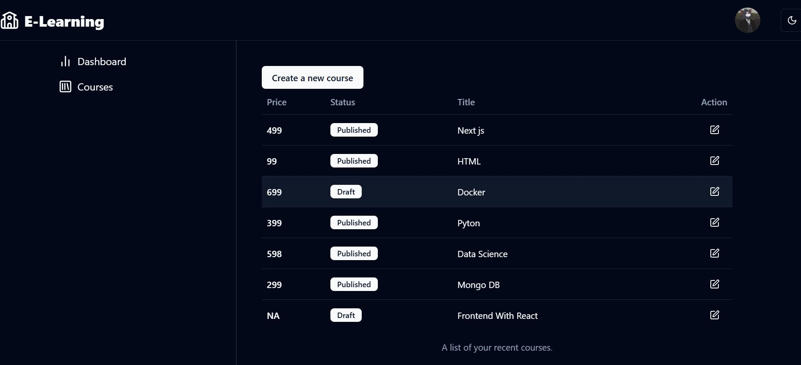
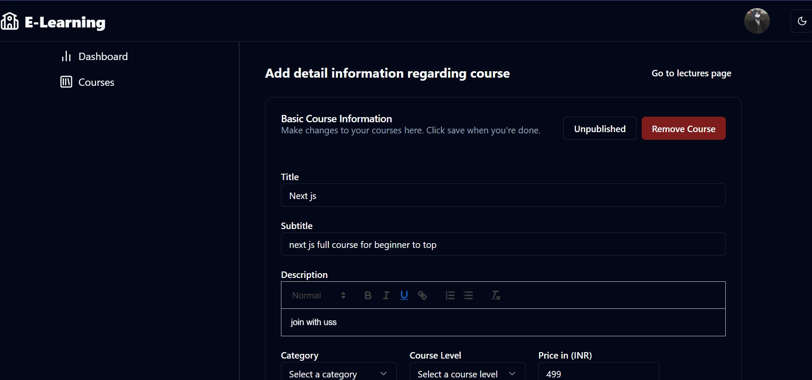
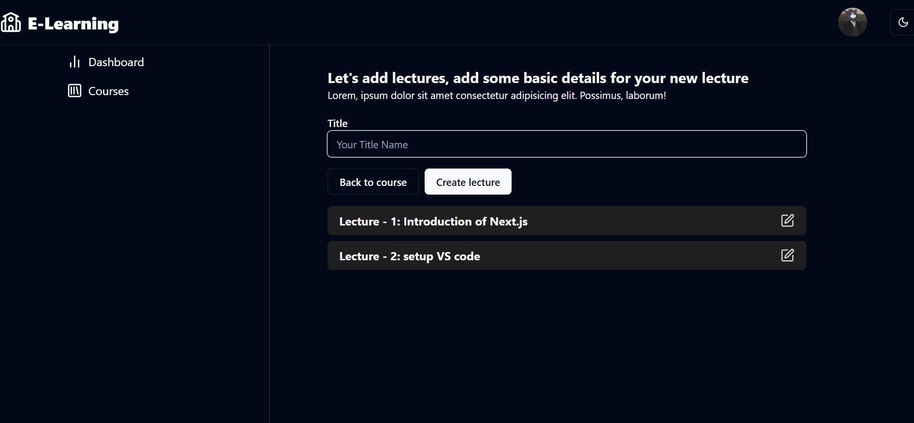
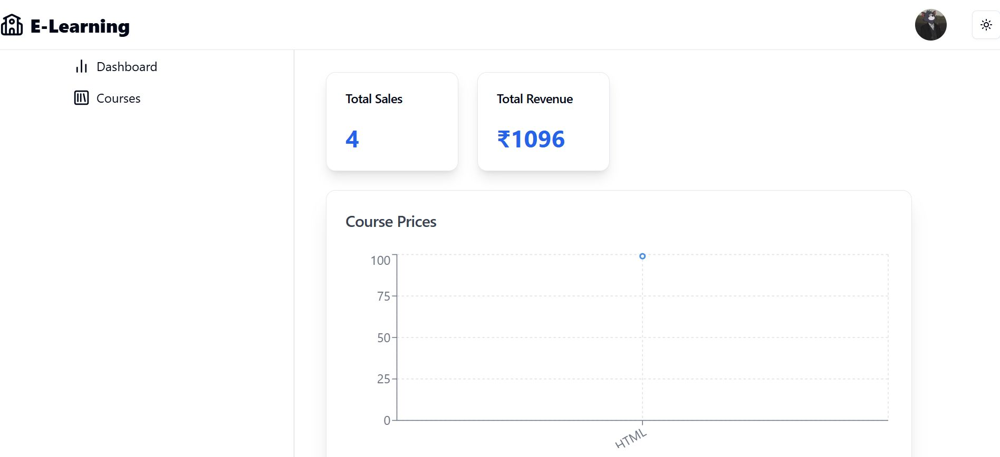

# 🎓 MERN E-Learning Platform

A **responsive E-Learning web application** built using the **MERN Stack**, designed to provide a seamless learning experience for students and powerful course management tools for admins.

---

## 🚀 Project Overview

This platform allows **admins to create and manage courses**, while **students can securely purchase courses, watch video lectures, and track their learning progress**.  
It is fully responsive and optimized for **desktop and mobile devices**.

---

## 🛠 Tech Stack

**Frontend**

- React.js
- ShadCN UI
- Tailwind CSS

**Backend**

- Node.js
- Express.js

**Database**

- MongoDB

**Payments**

- Stripe (Secure Payment Gateway)

**Authentication**

- JWT-based Authentication

---

## ✨ Key Features

### 🔐 Authentication & Security

- Secure login and registration
- Protected routes (no access without authentication)
- JWT-based authorization

---

### 🧑‍💼 Admin Panel

- Create and publish courses
- Add and manage video lectures
- Control course visibility
- Manage course content easily

---

### 🎓 Student Dashboard

- Browse and purchase courses
- Stream video lectures
- Track learning progress with a progress bar
- View enrolled courses

---

### 👤 Profile Management

- Update personal details
- Manage account information

---

### 💳 Payments

- Stripe integration for secure and smooth payments
- Safe checkout experience

---

### 📱 Responsive Design

- Works seamlessly on mobile, tablet, and desktop
- Clean and modern UI using ShadCN components

---

## 📂 Project Structure

client/ → React frontend
server/ → Node & Express backend
models/ → MongoDB schemas
routes/ → API routes
controllers/ → Business logic

---

## ⚙️ Installation & Setup

### 1️⃣ Clone the repository

```bash
git clone https://github.com/your-username/your-repo-name.git

2️⃣ Install dependencies

Frontend

cd client
npm install


Backend

cd server
npm install

3️⃣ Environment Variables

Create a .env file in the server folder:

MONGO_URI=your_mongodb_url
JWT_SECRET=your_jwt_secret
STRIPE_SECRET_KEY=your_stripe_key

4️⃣ Run the application

Backend

npm run dev


Frontend

npm start

         
```
What I Learned

Building scalable MERN applications

Secure authentication & authorization

Stripe payment gateway integration

Role-based dashboards (Admin & Student)

Creating responsive and modern UI

Managing real-world application workflows

🔗 GitHub Repository

👉 https://lnkd.in/g_K_NwWk

🤝 Feedback

Feedback and suggestions are always welcome!
Feel free to fork, star ⭐, or contribute to the project.